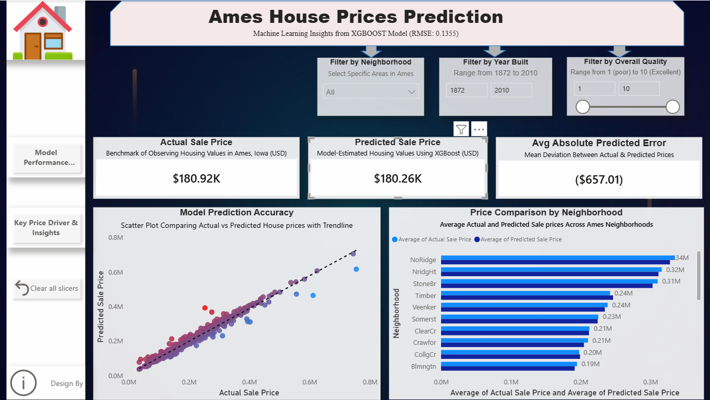
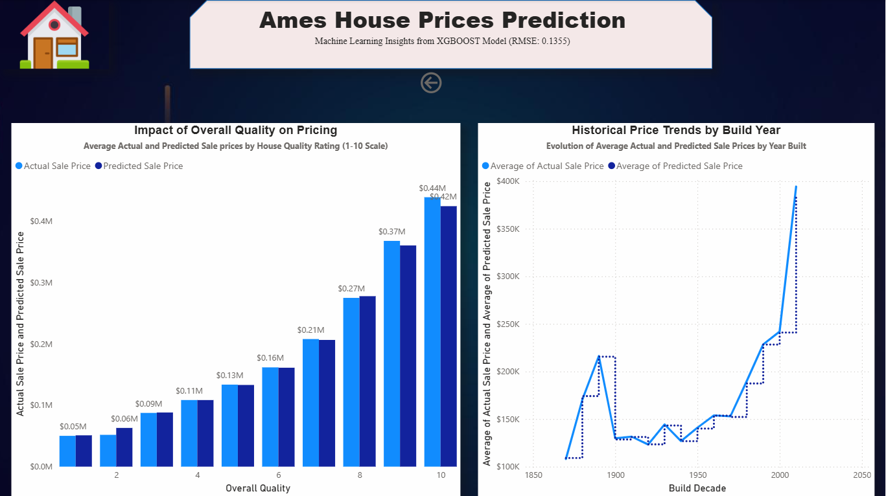

# 🏠 Ames House Price Prediction & Interactive Dashboard

**End-to-End Machine Learning + Data Visualization Project**  
I built a predictive model for house prices in Ames, Iowa, and created an interactive Power BI dashboard for business insights.

  
*Model Performance Overview Page*

  
*Key Price Drivers & Insights Page*

## 📊 Project Overview
This project demonstrates a complete data analytics workflow:
- **Predictive Modeling** (Python): Built an XGBoost regression model to forecast house prices.
- **Data Visualization** (Power BI): Created an interactive dashboard to explore predictions and key drivers.
- **Dataset**: Kaggle's "House Prices - Advanced Regression Techniques" (Ames Housing dataset, ~1,460 properties).

**Key Results**:
- Achieved **RMSE: 0.1355** (log-scale) on validation set.
- Identified top drivers: Overall Quality, Above-Ground Living Area, Total Square Footage, Neighborhood.

**Skills Demonstrated**:
- Python (Pandas, Scikit-learn, XGBoost)
- Exploratory Data Analysis & Feature Engineering
- Machine Learning (Regression, Tuning)
- Power BI (DAX Measures, Interactive Visuals, Slicers)
- Data Storytelling

## 🚀 Live Dashboard
[View Interactive Power BI Report](https://app.powerbi.com/links/ssJvU1k9yp?ctid=21abb5bf-31bc-4c74-a5bd-25e3727b8d91&pbi_source=linkShare)

## 🔍 Key Insights from the Dashboard
- Houses with **Overall Quality 8–10** sell for 2–3x more than low-quality ones.
- Premium neighborhoods (e.g., NoRidge, NridgHt) command significantly higher prices.
- Model predictions closely align with actual prices (tight scatter plot with trend line).
- Average prediction error: ~$657.01 USD.

## 🛠️ Tech Stack
- **Python**: Pandas, Matplotlib, Seaborn, Scikit-learn, XGBoost
- **Environment**: Google Colab
- **Visualization**: Power BI Desktop & Service
- **Dataset Source**: [Kaggle Competition](https://www.kaggle.com/c/house-prices-advanced-regression-techniques)
---

**Built by Augustine Nwenewor | January 2026**  
Connect with me: [LinkedIn](https://www.linkedin.com/in/augustine-nwenewor/) | [Portfolio](https://sites.google.com/view/nwenewor/home)

⭐ Star this repo if you found it helpful!
